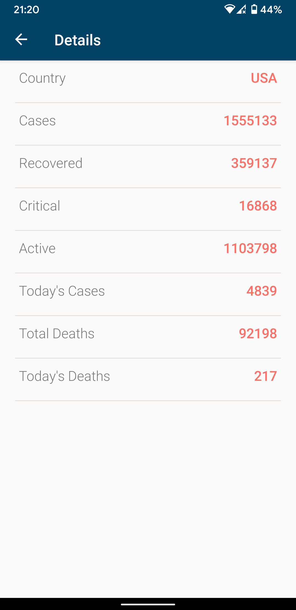

# COVID-19 TRACKER 

The link for the Project Video
https://youtu.be/GYKad9HBJus

## ABSTRACT
We all know that the world is dealing with an unprecedented challenge of the coronavirus
which has infected millions across the globe. The virus very contagious and has spread to
almost all the countries except a few. In these tough times we ought to know the situation
around us and in order to stay safe. This was the primary idea behind development of the
COVID -19 tracker app which provides information on our android device. The app provides
a platform to the user where he can track the total number of COVID-19 cases all over the
world. This app provides the details like total cases, recovered cases, demised cases, active and
critical cases which is enough to know that whether travelling is safe or not. The app also
includes a search bar for the users to navigate through the list of countries affected by the
COVID -19 and look at the statistics of a particular country. It also has an additional feature
which allows you to report your symptoms which might enable the authorities to take an early
and informed decision. It also lets users assess and report his symptoms or any travel history
which is stored on the cloud and help in identifying hotspot and cluster zones. The app we have
developed makes use of Cloud Firestore, REST API and volley library to achieve its purpose. 

## MOTIVATION
With humanity’s on-going fight with the pandemic of COVID-19 disease, we have developed
a COVID-19 Tracker app. Although some of the medical institutions have made progress
regarding the vaccine development, there is no surety about the vaccine reaching to the masses
in the immediate future. The app can help authorities to do regressive contact tracing, identify
hotspots that can help slow the spread and flatten the curve. The stored data on the cloud can
be visualized and studied by the epidemiologists to forecast future trends and aid authorities in
taking necessary actions

## DESIGN
The simple arc loader is used in the app which is a sign of data being fetched from the server.
Pie chart along with the legends are present on the home screen. Global stats are displayed
below the pie chart. The track countries will direct to the list of affected countries. All of the
items in this list view have an onClick listener which will direct to the details of that particular
country. The data received was in the JSON format. The check status button on the main
activity opens a new activity where the user can choose from two options. One option being to
assess and report himself and the other one is to view info in the area around him. The assess
yourself option asks the user questions about his travel history and if he has any symptoms and
stores this information on the firebase cloud. Each user’s information is stored in different
documents. In the view info activity, the java code fetches the data from the cloud and displays
the total number of suspected cases in the region the user is located, and it tells how safe the
area is for the user.

**App Screenshots**

# TECHNOLOGIES USED
1. **Android Studio:** We have developed the android app using Android Studio. It is the
official IDE for google’s android development platform. Its extended features enable easy
development of an android app as compared to the eclipse. Its template-based design
structures facilitate easy design of the layout by adding and adjusting the standard
components like buttons, views, texts and other aesthetics. It has built-in support for the
Google Cloud Platform which allows to integrate Firebase Cloud Messaging and Google
App Engine. The gradle based app building and android-specific refactoring provides a
very conducive and user-friendly platform.
2. **Firebase:** Firebase is a mobile and web application development platform developed by
Google. It can be integrated with the Android Studio and can be used to store data entered
by the user on the app to the cloud. This data can be accessed by the owner of the app and
can be used for multiple purposes. This includes things like analytics, authentication,
databases, configuration, file storage, push messaging, and the list goes on. The services
are hosted in the cloud, and scale with little to no effort on the part of the developer. Client
SDKs provided by Firebase interact with these backend services directly, with no need to
establish any middleware between your app and the service.
3. **Cloud Firestore:**  It is a flexible, scalable database for mobile, web, and server
development from Firebase and Google Cloud Platform. It also offers seamless integration
with other Firebase and Google Cloud Platform products, including Cloud Functions. The
Cloud Firestore data model offers flexibility by allowing the use of hierarchical data
structures. It uses data synchronization to update data on any connected device. Cloud
Firestore also offers offline support. When an offline device is back in the network, the
Cloud Firestore will update the database and make the necessary changes.
4. **Pixel 3A:**  We are using google Mobile Phone Pixel 3A. It has a 64-bit Octa-core CPU
with Android Operating System version 10 installed in it.
5. **REST API:**  REST is the acronym for Representational State Transfer. It is an
architectural style for distributed hypermedia systems. By separating the user interface
concerns from data storage concerns, the user interface’s portability across multiple
platforms improves. This also improves scalability by simplifying the server components.
Each request from client to server must contain all the information necessary to understand
the request. Therefore, the session state is maintained solely on the network. When a
response is cacheable then a database cache is entitled to reuse the response data for later,
similar requests. By applying the generality software engineering principle to the
component interface, the overall system architecture is simplified, and interaction visibility
is improved. To get a uniform interface, multiple architectural constraints are required to
guide component behaviour. REST is characterized by four interface constraints: resource
identification; resource manipulation by representations; self-descriptive messages; and 
hypermedia as an application state engine. REST enables client functionality to be
expanded by downloading and executing applet or script code.
6. **Volley Library:**  Volley is an http library which facilitates faster and easier networking
for android apps. It has numerous desirable features. The network requests are
automatically scheduled on multiple concurrent network connections. Transparent disk and
memory response caching with standard HTTP cache coherence is present. There are
debugging and tracing tools which are an added advantage. Strong ordering that makes it easy
to correctly populate your UI with data fetched asynchronously from the network.

## TECHNICAL CHALLENGES
1. We faced a conundrum while trying to display the data in the graphical manner. We
finally decided to move on with the Pie chart.
2. We were unaware of the JSON format and the technicalities related to the received data.
3. We had trouble connecting to the cloud and integrating it with Android studio.
4. The querying system for the cloud database is relatively slower, therefore it is taking a
little longer duration to fetch the data from the cloud.
5. The application uses all the modern technologies with its updated version. When we
tried to run the app in the older version of the android, it was not working properly, and
some activities were not behaving properly. Therefore, we assume that the user uses
the updated version of the android and a relatively new mobile phone.

## IMPLEMENTATION 

The screen in Figure 1 is the home screen for the application. It gets displayed every time we
open the application. The numbers are updated every 10 minutes and initially there is a simple
arc loader while the data is being received. This is a Relative layout and the under that, we have
a constraint layout having two Card Views. The legends and the pie chart are a present in the
card view. Under that there is a scroll view just in case all the above-mentioned data is not
visible on the screen at a time. Below that we have two buttons each having a unique
functionality and directs us to the corresponding window. The TRACK COUNTRIES button
allows us to get country wise statistics. The check status button enables us to access a short
questionnaire which reports the data to the cloud and sends a response according to the
statistics.
The TRACK COUNTRIES button directs you to the activity mentioned above. This activity
has a search window and a list of all the affected countries in alphabetical manner. The search
window filters the search and displays the corresponding countries. All the countries are a part
of the list view. And we can click on any country to get its details.
Clicking on any country will direct us to the window shown in Figure 3. It has all the details
and these details are updated every 10 minutes.

Next on the home page is the “Check Status” button which is shown in Figure 1. When we will
click on that a new activity page will open which is there in Figure 4. In this activity there are
two buttons namely “ASSESS YOURSELF” and “VIEW INFO”. The “ASSESS YOURSELF”
activity will ask the user to enter his name, his travel history and if he possesses any symptoms.
This data entered by the user is stored in the google cloud firebase database. The “VIEW INFO”
button will tell the user about the suspected cases in his location and also whether his location
is safe or not depending upon the number of suspected cases We are able to give this
information by fetching the data which is stored in the cloud database. 

## EVALUATION
We tried to run our application for various cases. The cases also included a number of negative
scenarios like can we do not enter any information in the asked questions. All these scenarios
are now covered in the application. Since our application has a lot of cloud and API interaction,
the performance of our application solely depends on the response times of the cloud APIs. We
tried to find the average time of response but as said before since we are using free trial services
the service is very slow and response time is unpredictable. We also evaluated the performance
of each of the threads these again depend on services. Also, the amount of on mobile device
memory for storing data is minimal in our application since all the data is stored inside the
cloud

## FUTURE WORK
1. A notification feature can be added to the app such that whenever a new corona positive
tested person enters your area you will get an alert notification in your mobile phone.
2. We can integrate the app with the hospital official. So, if a person persists any
symptoms, he can be connected with the nearest testing centre and for health check-up
with the nearest hospital based on the location of the mobile.
3. We can also add the Bluetooth activity in the app. This activity will help the user to
find if he has been in contact with any positive case person so that he can take the
precautionary measures priorly.

## REFERNCES
1. https://developer.android.com/training/volley [Volley Library]
2. https://restfulapi.net/ [ REST API]
3. https://github.com/blackfizz/EazeGraph [Pie Chart]
4. https://github.com/generic-leo/SimpleArcLoader [Simple Arc Loader]
5. https://cloud.google.com/firestore/docs/client/get-firebase [FIREBASE]
6. https://cloud.google.com/solutions/mobile/mobile-firebase-app-engine-flexible
[Integration of app with Firebase]
7. https://firebase.google.com/docs/firestore/query-data/queries [Cloud Database]